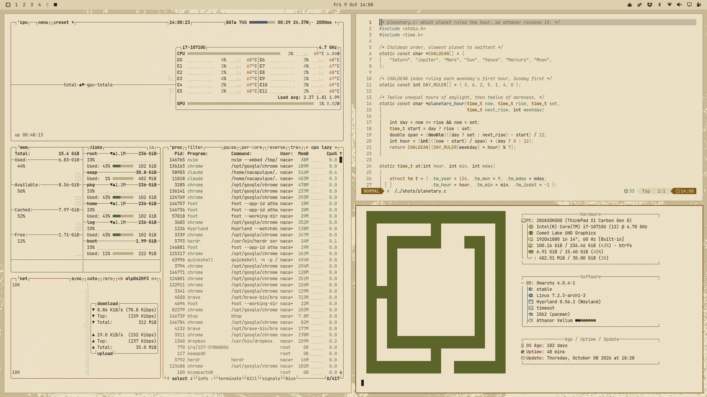

# Athanor Vellum

Iron-gall ink on parchment. A light [Omarchy](https://omarchy.org) theme based on
[Athanor](https://github.com/script-wizards/athanor) by Script Wizards, an
alchemical layer for Arch and Hyprland.

Athanor's four color schemes are the stages of the Magnum Opus. Vellum is
*albedo*, the whitening. Its companion is
[Athanor Umber](https://github.com/nacapulque/omarchy-athanor-umber-theme)
(*nigredo*).



## Install

```sh
omarchy theme install https://github.com/nacapulque/omarchy-athanor-vellum-theme
omarchy theme set athanor-vellum
```

`omarchy theme bg next` cycles the wallpapers, and `omarchy theme update`
pulls new versions of the theme.

## What's in it

| File | What it does |
|---|---|
| `colors.toml` | The palette. Omarchy generates the terminal, Hyprland, Neovim, btop, Helix, VS Code and shell colors from it. |
| `shell.bar.toml` | The status bar in Athanor's own bar colors. |
| `shell.*.toml` | The rest of the Omarchy shell in Athanor's style. See [Shell](#shell). |
| `backgrounds/` | Eight Doré plates plus the Omarchy logo wallpaper. |
| `icons.theme` | `Yaru-wartybrown` icons. |
| `preview.png`, `preview-unlock.png`, `unlock.png` | Theme switcher previews and the boot-unlock logo. |

### Palette

| Role | Color |
|---|---|
| Background | `#ece1c6` |
| Foreground | `#1f1914` |
| Accent | `#7c5510` |
| Selection | `#c2b492` |
| Muted | `#635441` |

ANSI red, green, yellow, blue, magenta and cyan: `#993421` `#525b20` `#764f06` `#3f5570` `#7a3f4c` `#375f49`.

The palette is Athanor's Vellum. The ANSI colors keep Athanor's hues,
with only their lightness nudged so terminal text holds up on every surface it
sits on:

- at least 5:1 on the background
- at least 4.5:1 on raised surfaces, such as editor cursorlines and herdr or
  Helix panels
- at least 3:1 inside a selection

Body text is above 12:1.

### Shell

The Omarchy shell follows Athanor's own UI: flat, opaque cards with a 2px
accent rule, and the selected row drawn in inverse, like Athanor's quit prompt
and its `--More--` line.

- **Menu and launcher:** opaque card, accent border, inverse selection.
- **Notifications and popups:** opaque, accent border and countdown.
- **Lock screen and password prompts:** an opaque card ruled in the accent,
  red on a wrong password.
- **Tooltips:** in the status bar's colors.
- **Controls:** keyboard focus gets the accent outline.

These style Omarchy's built-in shell plugins. A replacement notification or
lock plugin draws itself and may ignore them.

### Wallpapers

The wallpapers are Gustave Doré's wood engravings, dithered to two tones with
Floyd-Steinberg in the palette's ground and ink colors, as Athanor makes them.
They're 3840×2160, drawn on a 960×540 grid and pixel quadrupled, so the
dither stays crisp on 4K and scales down evenly to 1080p.

## What's not in it

This theme only carries Athanor's look. The roguelike status line, planetary
hours, tarot draws, lockscreen sigils, a plate per workspace, the bitmap fonts
and the notch plugin belong to
[Athanor itself](https://github.com/script-wizards/athanor). Install it for the
whole furnace.

## Credits

The palette, the dither recipe and the idea come from
[Athanor](https://github.com/script-wizards/athanor), MIT, © 2026 Script Wizards.
This theme isn't affiliated with or endorsed by them.

The plates are public domain, from Wikimedia Commons:

| # | Plate | From |
|---|---|---|
| 1 | [*Merlin leads the king out of the ruins*](https://commons.wikimedia.org/wiki/File:Idylls_of_the_King_1.jpg) | Idylls of the King, 1868 |
| 2 | [*Merlin shows the book*](https://commons.wikimedia.org/wiki/File:Idylls_of_the_King_15.jpg) | Idylls of the King, 1868 |
| 3 | [*Merlin and Vivien under the oak*](https://commons.wikimedia.org/wiki/File:Idylls_of_the_King_10.jpg) | Idylls of the King, 1868 |
| 4 | [*The old man in the grotto*](https://commons.wikimedia.org/wiki/File:Idylls_of_the_King_17.jpg) | Idylls of the King, 1868 |
| 5 | [*Hooded figures in the black forest*](https://commons.wikimedia.org/wiki/File:Orlando_Furioso_31.jpg) | Orlando Furioso, 1879 |
| 6 | [*The lamp-lit hall*](https://commons.wikimedia.org/wiki/File:Orlando_Furioso_6.jpg) | Orlando Furioso, 1879 |
| 7 | [*The graveyard under the moon*](https://commons.wikimedia.org/wiki/File:Dore_The_Raven_1884-15.jpg) | The Raven, 1884 |
| 8 | [*Satan's despair*](https://commons.wikimedia.org/wiki/File:Gustave_Dore_Satan%27s_Despair.jpg) | Paradise Lost, 1866 |

## License

MIT. See [LICENSE](LICENSE).
